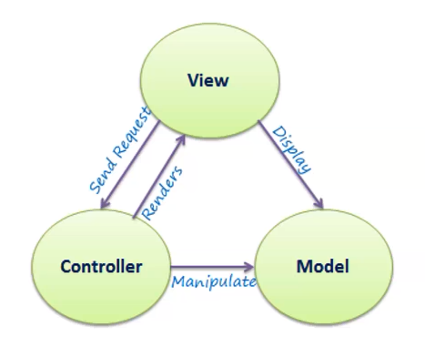
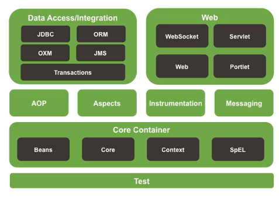
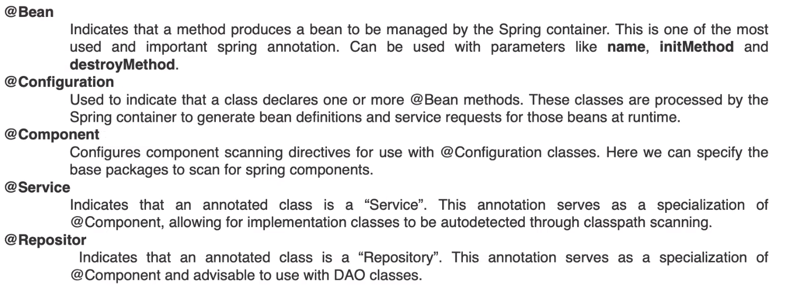

# Spring Boot
## What is Spring?
Spring is a framework that provides integral structure to build java applications, focus on features and business logic.
### Dependency injection

### Inversion of control
Something have the control of the object, usually is a framework and it defines when the object dies, creates and uses.
### Framework
tools, modules to use to make multiples new projects 
### POJO
Kind of objects a independent class to use in different objects, can be attributes.
### MVC
* Model
* Viewer
* Controller

### Spring modules
* DAO: Interact with the database
* Web: Create web applications
* AOP: add enterprise functionality as transactions or security
* Core container IoC Container: Create objects and it can make them as together and controls lifecycle from initiation to termination.

#### IoC Container
* Dependency injection is the heart of Spring
* Make the code **loosely coupled**
* Dependency lookup

**Beans:** The objects that form the backbone of the application and are managed by the IoC container. Spring IoC manage the bean lifecycle.

### Spring boot
Eliminates the configuration process on spring, easy to use and create projects.
### [Why spring?](https://spring.ip/whi-spring)
* **Everywhere:** trust on the extensive libraries and resources.
* **Flexibility** Spring's flexible with third party libraries and more.
* **Productive:** easy and convenient to develop
* **Fast:** helps developers build application easy and with far less effort.
* **Secure:** Spring has a big background and security issues experience. 
* * **Supportive:** Great and big community. 

## Spring Annotation
Allows a developer to manage the bean dependencies.

## Setup Spring
Enter to [start](https://start.spring.io/) 
## Simple Rest
## Spring Data

## References
[www.bealung.com](www.bealung.com/spring-intro)
[spring.io](spring.io)