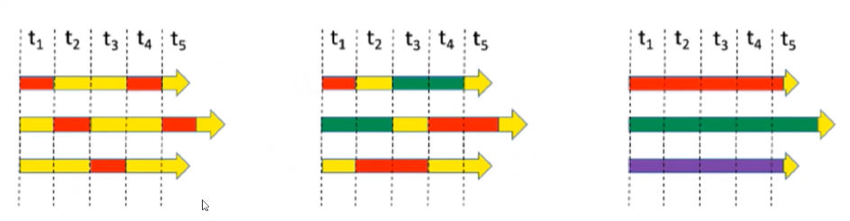
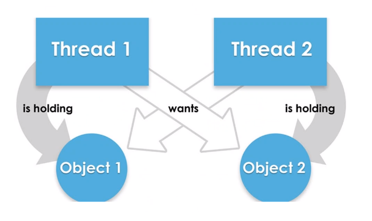
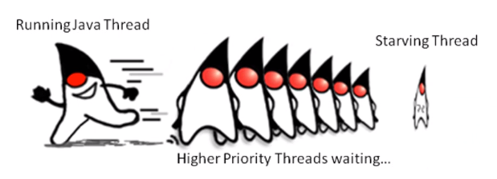
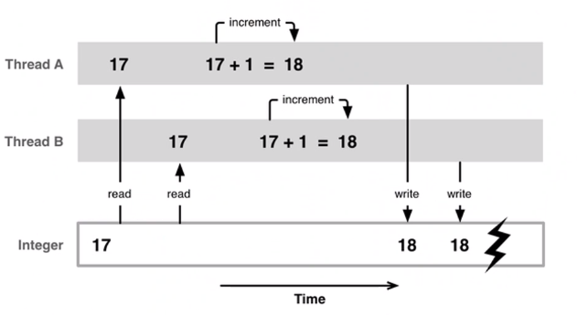
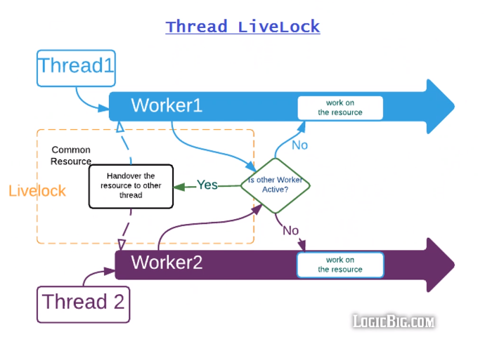

# Concurrency
## Concurrency
* When two task can star, run and complete in overlapping time periods
* By design

## Parallelism
* When tasks literally run at the same time
* By doing

## Example

## Some terminology
* Thread
  * Smallest unit of execution
* Process
  * Group of associated Threads that can execute in the same shared 
* Task
* Shared Environment

## Concurrency problems
### Deadlock
* Is a problem in the miltithreading application witch makes an application to hang indefinitely.

### Starvation
* A single thread is perpetually denied access to a shared resources or lock.
* The thread is active but unable to make the task

### Race conditions
* Undesirable result that occurs when two task are complete at the same time, witch should have been completed sequentially.

### Live locks
* two or more threads are conceptually blocked forever, although they are each still activate and trying to complete their task

## Java API concurrency
