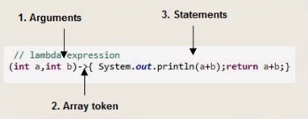

## Lambda expressions 
Are anonymous functions, functions that **do not need a class** Usually used to transform data.
* Most readable
* Optimize
* Maintainable
### Parts

### Example
Filter am array for a value
```java
cars.forEach(car ->{
    if("Renault".equals(car.getCompany()))
        System.out.printLn(car.getModel())
})
```
### Possibility to declare
* No parameters
  * ```()->true```
  * ```-> //Does not work```
* One parameter
  * ```(int a) -> true```
  * ```a -> true```
* More than one Parameters
  * ```(int a, int b) -> true```

## Predicates
```java
Predicate<Car> predicateCar = car -> "Honda".equals(car.getCompany())
```